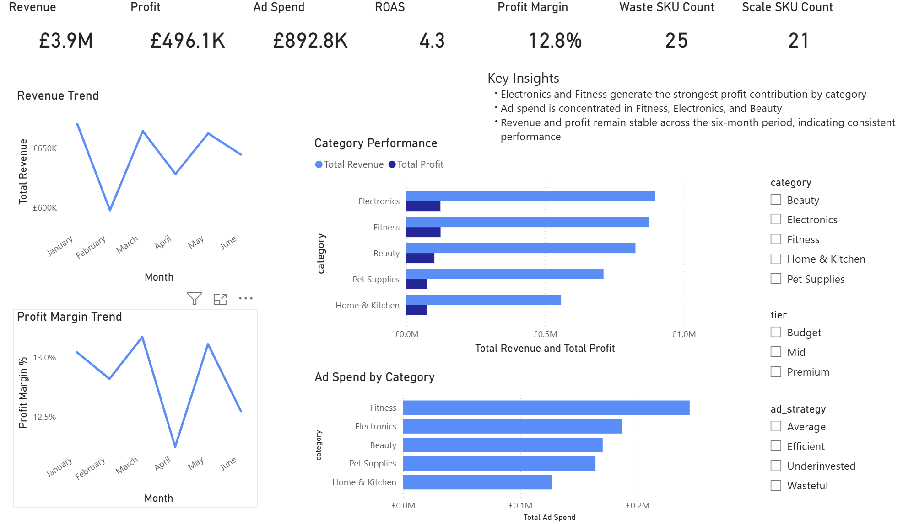
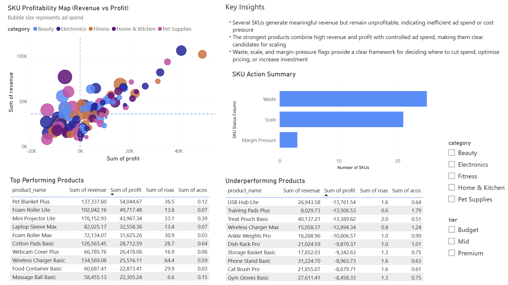
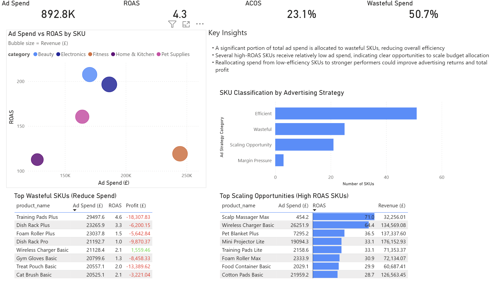

Amazon Seller Performance Audit Dashboard

This project analyses e-commerce and advertising performance data for an Amazon-style seller to identify inefficiencies in ad spend, highlight high-return opportunities, and provide clear, actionable recommendations to improve profitability.

The dashboard is designed to replicate a real-world client audit, focusing on how data can be translated into commercial decisions rather than just descriptive analysis.

Project Overview

This analysis explores the relationship between revenue, profit, and advertising performance across products (SKUs).

The project answers key business questions such as:

Which products are generating revenue but losing money?
Where is advertising budget being wasted?
Which products deliver strong returns and should be scaled?
How can ad spend be reallocated to improve overall profitability?

The goal is to demonstrate how data analysis can be used to move from insight to action in a commercial setting.

Dashboard Structure

The Power BI dashboard is structured into three key pages:

1. Executive Summary

Provides a high-level overview of performance, including:

Total revenue, profit, and ad spend
Overall ROAS and profit margin
Wasteful and scalable SKU counts
Key insights summarising business performance

This page is designed for quick decision-making by stakeholders.

2. Product Performance

Analyses how different products and categories contribute to revenue and profit.

Key features:

Revenue and profit trends over time
Category-level performance comparison
Identification of high-performing and underperforming SKUs
Insight into profit concentration and product mix

This page helps identify where value is being generated across the product portfolio.

3. Advertising Opportunities

Focuses on advertising efficiency and optimisation opportunities.

Key features:

Ad Spend vs ROAS scatter plot to identify inefficiencies and opportunities
SKU classification into:
Efficient
Wasteful
Scaling Opportunity
Margin Pressure
Tables highlighting:
Wasteful SKUs that require spend reduction
High-ROAS SKUs with scaling potential

This page translates performance data into clear commercial actions.

Key Insights
A significant portion of advertising spend is allocated to low-ROAS SKUs, reducing overall efficiency
Several products generate strong revenue but remain unprofitable, indicating cost or pricing issues
High-ROAS products often receive relatively low ad spend, presenting clear opportunities to scale investment
Reallocating budget from inefficient SKUs to stronger performers could materially improve both advertising returns and total profit
Tools and Technologies
Python (Pandas, NumPy) for data generation and preparation
Power BI for dashboard development and visualisation
Jupyter Notebook for analysis workflow
Files Included
amazon_seller_performance_audit.pbix – Power BI dashboard
project_13_dataset_generation.ipynb – data generation and preparation
project_13_dataset_generation.py – script version of the data generation
data/ – datasets used in the analysis
images/ – dashboard screenshots
Dashboard Preview
Executive Summary

Product Performance

Advertising Opportunities

Conclusion

This project demonstrates how data analysis can be used to go beyond reporting and drive decision-making.

By combining product performance and advertising efficiency analysis, the dashboard provides a clear framework for:

Reducing wasted spend
Scaling high-performing products
Addressing margin issues

The result is a structured, insight-driven approach to improving profitability in an e-commerce environment.
